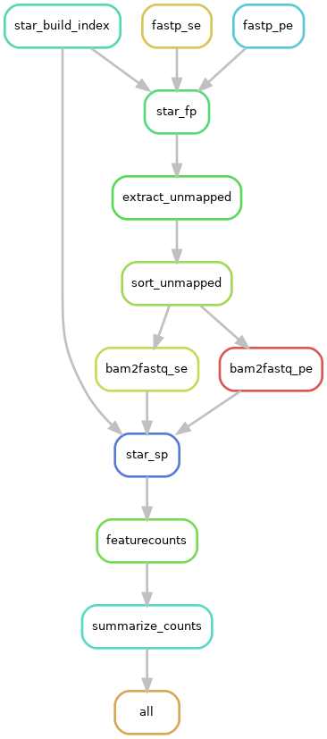

This workflow is my attempt at modernizing, and generalizing existing viral infection detection pipelines. Using snakemake to implement computational scaling and parallelisation of analysis tasks.

## Basic usage
This pipeline consists of two seperate workflows: *init* and *run*, where *init* initializes files needed for the pipeline in the current working directory. After filling out the resulting files *run* can be called to start the pipeline.

``` Python
usage: viralfind [-h] {init,run} ...

positional arguments:
  {init,run}  Choose init or run.
    init      Initialize the pipeline in the current directory.
    run       Runs the pipeline in the current working directory.

options:
  -h, --help  show this help message and exit
```

## 1. Init workflow
The init workflow creates three files into the current working directory, these files are:

### config.yaml
The config.yaml file contains essential parameters for running the pipeline:
- **run**: Directory where all pipeline-generated files will be stored.
- **results**: Subdirectory within run to store final results.
- **fastq_dir**: Path to the directory containing your FASTQ sample files.
- **samplesheet**: Path to the samples.tsv file containing metadata about your samples.
- **genome_dir**: Directory housing your genome files.
- **first_assembly**: Directory name of the first genome assembly (e.g., human genome).
- **second_assembly**: Directory name of the second genome assembly (e.g., HPV metagenome).
- **assembly_file**: Path to the assemblies.tsv file used to construct a custom metagenome.
- **merge_replicates**: Boolean flag indicating whether to merge the count table based on the replicate_group column from samples.tsv.

### samples.tsv
The samples.tsv file provides metadata for your FASTQ samples, structured as follows:
- **samples**: The base name of your FASTQ files without the file extension or _R1/_R2 suffixes.
- **alias**: The name to which your FASTQ samples will be renamed for processing.
- **condition**: Placeholder for experimental conditions (not implemented in the current pipeline).
- **replicate_group**: Identifies groups for merging replicates in the final count table.

### Assemblies.tsv
The assemblies.tsv file is based upon the output of [genomepy search](https://github.com/vanheeringen-lab/genomepy). 
The most important columns are **name**, **provider**, and **species**. These need to be filled out otherwise it doesn't work.
If there is no annotation (the **annotation** column will be False), the assembly cannot be used.

## Workflow Structure
1. **Metagenome Construction:**
    - Constructs a custom metagenome from multiple assemblies.
2. **Quality Control & Trimming:**
    - **fastp:** Trims and assesses quality of reads.
3. **Mapping:**
	1. **STAR First Pass:** Maps reads to the first assembly.
	2. **Extract Unmapped:** Extracts unmapped reads.
	3. **STAR Second Pass:** Maps unmapped reads to a custom metagenome.
4. **Data Processing:**
    - **featureCounts:** Counts features from the aligned BAM files.

## Detailed DAG of the rules

